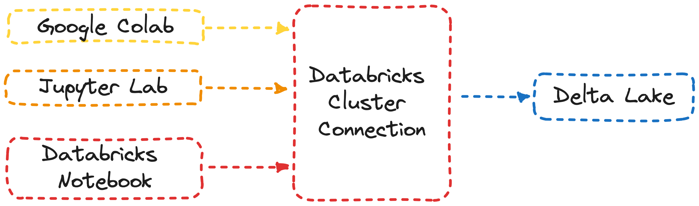

# Delta Lake I/O with Pandas DataFrames

## Use-Cases

* Read and write Delta Lake tables into Pandas DataFrames.
* Access Schemas and Catalogs as Pandas DataFrames
* Access Delta lake from external services for table reads and writes

## Structure

A running cluster on a Databricks workspace is required to interface any outside data from pandas DataFrames to mediate access and I/O with Delta lake.

</img>

See more details in the notebook (`ipynb`)
