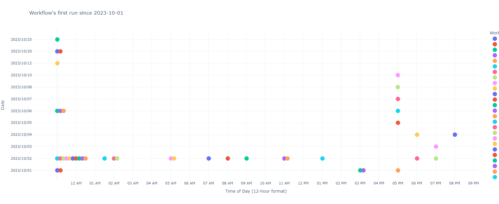

# Workflow Calendar 📆

## Introduction

This notebook is designed to visualize aspects related to workflow schedules and their respective runs. This allows one to gain a clear understanding of the scheduling, execution, and performance of your tasks. Whether you're interested in the first scheduled run, a specific time range, or overall performance, this notebook has got you covered.

## Use Cases

This notebook is perfect for a range of use cases:

1. **Performance Monitoring**: Keep an eye on how long your runs are taking and identify potential bottlenecks.
2. **Scheduling Insights**: Understand when your workflows are scheduled and when the first run occurred. Resolve timing conflicts and ensure that your workflows are running as expected.
3. **Historical Analysis**: Analyze the historical data of your runs, making it easier to identify trends and patterns.
4. **Resource Allocation**: Optimize your resource allocation based on past performance.
5. **Troubleshooting**: Quickly identify runs that failed or took longer than expected.

</img>

---

See more details in the notebook (ipynb)
