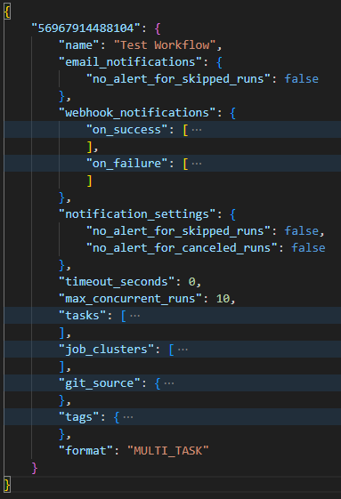

# Backup your Databricks Workflows 🗃

    

## Introduction

This notebook is used to fetch the jobs config from a workspace and then write it to disk thus helping one save a backup of their workflow config information. While such a backup can also be created using Terraform or other Infrastructure-as-code providers, this approach provides it using the vanilla JSON of the Databricks REST API.

## Use Cases

Areas where such a notebook may be helpful:

1. Backup of workflow config information in case of restoration from Databricks REST API
2. Version controlling of workflow config information

---
</img>
---
See more details in the notebook (ipynb or dbc)
